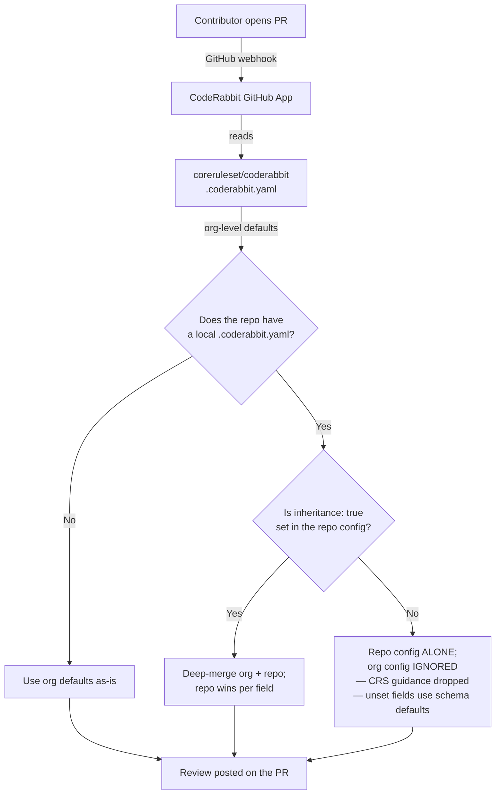

# coreruleset/coderabbit

Org-wide [CodeRabbit](https://coderabbit.ai) configuration for the [coreruleset](https://github.com/coreruleset) GitHub organization.

This repository contains the canonical `.coderabbit.yaml` that CodeRabbit applies across every repo in the org as a default. Individual repos can override settings by committing their own `.coderabbit.yaml`.

> ⚠️ **A repo's `.coderabbit.yaml` only inherits the org settings below if it sets `inheritance: true` at the top.** Without that flag the org config is **ignored entirely** for that repo: the CRS rule-review guidance, every pre-merge check, and every tool toggle silently drop, and any field the repo didn't set falls back to the schema default (not the org value). See [Overriding per Repository](#overriding-per-repository).

---

## Why an Org-Wide Config?

The org holds two very different kinds of repository, and a generic reviewer serves neither well:

- **the rule set** — `coreruleset`, the `*-rule-exclusions-plugin` repos, `coraza-coreruleset`: seclang `.conf`, regex-assembly `.ra` sources, go-ftw regression YAML;
- **its tooling** — `go-ftw`, `crs-toolchain`, `albedo`, `rassemble-go`, `libinjection-go` (Go); `crs-linter`, `msc_pyparser` (Python).

Reviewing a `SecRule` needs rule ID ranges, paranoia-level policy, approved tags, and RE2 compatibility. Reviewing `crs-toolchain` needs error wrapping and goroutine lifetimes. Path-scoped guidance is what keeps each from being reviewed as the other, and it is the main design constraint on the file.

Beyond that:

- **one source of truth** — review behaviour, checks, and tool enablement are set once and apply everywhere;
- **new repos covered by default** — plugin repos and new tooling get the same review on day one;
- **community contributions get a real review** — `enable_free_tier` and `allow_non_org_members` are on because CRS takes drive-by contributions from outside the org.

---

## How It Works



---

## Contents

| Path | Purpose |
|------|---------|
| [`.coderabbit.yaml`](.coderabbit.yaml) | The org-wide CodeRabbit configuration — the entire deliverable |
| [`.github/workflows/validate-coderabbit.yml`](.github/workflows/validate-coderabbit.yml) | Validates YAML syntax and the config against the CodeRabbit schema |
| [`renovate.json`](renovate.json) | Renovate config, extending the shared org preset |
| [`AGENTS.md`](AGENTS.md) | Working notes for AI coding agents editing this config |
| [`CLAUDE.md`](CLAUDE.md) | Imports `AGENTS.md`, so Claude Code picks up the same notes |
| `README.md` | This file |

---

## What the Config Does

### Review behaviour

`profile: chill` (fewer, higher-signal comments), `request_changes_workflow: false` (advisory, never a hard block), incremental review on update commits, drafts skipped, and titles generated as conventional-commit types — `coreruleset` runs `amannn/action-semantic-pull-request`, so a non-conforming title fails CI. Poems, fortunes, and sequence diagrams are off. `finishing_touches` (AI-authored docstrings, tests, simplifications) is **disabled org-wide**: [AI-CONTRIBUTIONS.md](https://github.com/coreruleset/coreruleset/blob/main/AI-CONTRIBUTIONS.md) requires a human to disclose and vouch for AI-assisted content, which an auto-pushed commit cannot satisfy.

`base_branches` covers `main` and `lts/v.*` — backport PRs target LTS branches directly and must still be reviewed.

### Labels

Two independent families. Label names are matched **literally**, emoji shortcode included, and CodeRabbit never creates them — a label that doesn't exist in the repo silently no-ops.

**`release:*` — the changelog taxonomy.** `.github/release.yml` in `coreruleset` groups the generated release notes by these and excludes `release:ignore` entirely. They loosely mirror conventional-commit types, and `mutually_exclusive_groups` enforces exactly one per PR.

| Label | Applied when | Title type |
|---|---|---|
| `release:new-detection` | CRS detects something it did not before — new `SecRule`, new `.ra` branch, widened `*.data` | `feat:` |
| `release:new-feature` | a capability rather than a detection — a setup option, plugin hook, toolchain flag | `feat:` |
| `release:fix` | a false positive narrowed, a false negative closed, a broken regex, a ReDoS or RE2 fix, a tooling bug | `fix:` |
| `release:remove-rules` | one or more rule IDs deleted | — |
| `release:refactor` | restructuring with byte-identical behaviour | `refactor:` |
| `release:breaking` | existing configuration stops working — removed/renumbered rule ID, removed tag or config key | — |
| `release:important` | operators should be aware, but need not act — changed default, PL move, scoring change | — |
| `release:ignore` | **the default.** chores, CI, docs, tests, typos, any fix with no user-visible effect | `chore:` etc. |

There is no "no label" outcome; when nothing else fits, the answer is `release:ignore`.

**Topic labels** are independent of that family and used for triage: `:heavy_plus_sign: False Positive`, `:heavy_minus_sign: False Negative - Evasion`, `:mage: regex-assembly`, `:gem: re2-compat`, `:test_tube: testcase`, `:jigsaw: plugin`, `:bomb: sqli`, `:book: documentation`.

### Path instructions — per-file, line-level

Nine glob-scoped entries. These carry the domain knowledge a generic reviewer does not have, and they are where a finding needs to land on a specific line.

| Path | What it reviews |
|------|-----------------|
| `rules/*.conf` | seclang detection rules: ID range and family, metadata and approved tags, anomaly scoring via the score variables, paranoia-level tag matching its `TX:DETECTION_PARANOIA_LEVEL` guard, `t:none` first, target lists, `@pm` vs `@rx`, chain structure, phase, and never hand-editing a compiled regex that has a `.ra` source |
| `plugins/*.conf` | the same invariants plus plugin specifics: a core-range rule ID is a blocker, `*-before`/`*-after`/`*-config` file ordering, the plugin-enabled guard, no direct writes to core `tx.*` state |
| `crs-setup.conf.example` | shipped defaults, not patterns: anomaly thresholds, paranoia levels, sampling, body limits, uncommented `SecAction`, `setvar` names no rule reads |
| `rules/*.conf.example` | exclusion templates: must stay inert, 900-before vs 999-after placement, no deprecated v3 idioms operators would copy verbatim |
| `**/*.ra` | regex-assembly: RE2-only constructs, no multi-byte UTF-8 inside `[...]`, never hand-write `\s\x0b`, `{{define}}` vs `##!=>` named assemblies, defines not propagating across includes, ReDoS-shaped ambiguity |
| `**/tests/**/*.yaml` | go-ftw tests: filename ↔ `rule_id`, contiguous `test_id`, `expect_ids` naming the rule under test, wire-encoded payloads, a negative test for every widened pattern |
| `**/*.go` | error wrapping and `errors.Is`/`As`, no panic in library code, context propagation, goroutine lifetimes, data races, regex compiled in hot paths, unbounded reads of untrusted input |
| `**/*.py` | swallowed exceptions, CLI exit semantics, coupled argument validation, explicit `encoding=` on files holding raw attack payloads, module-level regex, mutable defaults |
| `**/.github/workflows/**` | actions pinned to a full SHA, `persist-credentials: false`, `${{ github.event.* }}` injection, over-broad `permissions`, `pull_request_target` with a head checkout, and the base-branch filter trap |

### Pre-merge checks — whole-PR, cross-file

Thirteen checks, all `mode: warning`. These evaluate the diff as a unit and catch invariants no single line can express.

**CRS-specific:**

| Check | Catches |
|---|---|
| Regex Assembly Is the Source of Truth | a `.conf` `@rx` edited without its `.ra` — pre-commit.ci silently reverts it, so the change appears merged but is not |
| Rule Change Requires go-ftw Test Coverage | a rule added, widened, narrowed, or removed without its test file moving with it |
| ReDoS Risk & RE2 Compatibility | RE2-incompatible constructs (blocker), backtracking ambiguity, and the start-of-match shape confirmed on 942130/942131/942180 |
| False Positive Risk & Existing Coverage | a new pattern with no proof the payload is undetected — the PL4 probe, the sibling baseline, the subset argument, and the libinjection caveat |
| CRS Rule Metadata & ID Conventions | what crs-linter fails on: ID collisions and range violations, unapproved tags, stale `ver:`, ordering |
| Rule & Config Breaking Changes | removed or renumbered rule IDs, changed defaults, removed tags, tooling API changes — plus the documentation counterpart |
| AI Contribution Disclosure | a missing or generic `## ai disclosure`, missing `## what`/`## why`/`## refs`, and attribution trailers this project does not use |

**Supply chain and appsec:**

| Check | Catches |
|---|---|
| OWASP Security (Web, API & LLM) | the classes CRS itself writes rules for, in the code that implements them |
| Unpinned Dependencies & Actions | unpinned `uses:`, Go/Python/npm/Docker/Terraform/Helm version drift, unpinned CI tool versions that diverge from what CI runs |
| New Dependency Scrutiny | a newly added dependency, Action, or plugin with no justification — typosquats, single-maintainer packages, transitive surface |
| Install & Build-Time Code Execution | pipe-to-shell installers, `GOSUMDB=off`, npm lifecycle scripts, unverified Docker build-time fetches, Terraform provisioners |
| Secrets, Payloads & PII in Logs | credentials, over-broad `logdata:` in rules, full-object logging, and committed traffic captures |
| Renovate: config present and valid | a missing config, a wrong `$schema`, or one not extending `github>coreruleset/renovate-config` |

### Tools

| Enabled | For |
|---|---|
| `golangci-lint` | Go — the majority of CRS tooling |
| `ruff` | Python — crs-linter, msc_pyparser, `util/` scripts, the test harness |
| `yamllint`, `shellcheck`, `actionlint`, `zizmor`, `hadolint`, `checkov`, `markdownlint`, `github-checks` | config, shell, CI, containers |
| `trivy`, `osvScanner`, `trufflehog`, `gitleaks`, `presidio`, `opengrep`, `skillspector` | security scanning |

| Disabled | Why |
|---|---|
| `semgrep` | overlaps `opengrep` and would double-flag; opengrep runs with a default config where semgrep would be skipped |
| `flake8`, `pylint` | ruff already covers their rules and would double-report on the same lines |
| `fbinfer`, `pmd` | no JVM or C/C++ code in the org |
| `oasdiff` | no OpenAPI specs to diff |
| `languagetool` | off by default; the documentation repos can opt in locally |

### Knowledge base

`code_guidelines` ingests `CLAUDE.md`, `AGENTS.md`, `CONTRIBUTING.md`, `AI-CONTRIBUTIONS.md`, `BACKPORT_POLICY.md`, and `docs/**/*.md`.

`linked_repositories` is capped at 20 by the schema and is selected by **dependency edge**, not by relevance — a repo earns a slot when something can break across the boundary:

| Repo | Why it's linked |
|---|---|
| `coreruleset` | rule IDs and family ranges, `util/APPROVED_TAGS`, paranoia-level policy, the regression suite layout |
| `go-ftw` | the test runner; its CLI and config are invoked by coreruleset CI and every plugin repo |
| `ftw-tests-schema` | the authoritative YAML schema every test file must conform to |
| `crs-toolchain` | `.ra` directive semantics, and the pre-commit hooks that revert hand-edited regex |
| `crs-linter` | what actually fails CI — the authority on whether a metadata issue is a build failure |
| `plugin-registry` | reserved rule ID ranges per plugin |
| `actions` | reusable composite Actions shared across org workflows |
| `renovate-config` | the shared preset every repo extends |
| `documentation` | the source of truth for everything operators are told, and the counterpart obligation for any user-visible change |

Deliberately excluded: `template-plugin` and `modsecurity-crs-docker` — they consume the rule set, but nothing breaks across the edge.

---

## Conventions for New Checks

Follow these when adding to `path_instructions` or `custom_checks`; the file is consistent about them and reviews read worse when it isn't.

- **Finding format is fixed:** `⚠️ WARNING: <description> — <fix>`. `❌ blocker` is reserved for RE2-incompatible regexes, plugin rules in a core ID range, and hand-edited compiled regex that pre-commit.ci will revert.
- **Every check is `mode: warning`.** Escalating one to `mode: error` also requires `request_changes_workflow: true`, and should follow a validated low false-positive rate on real CRS PRs.
- **Open ecosystem- and rule-scoped checks with a trigger condition** that returns `Passed` plus "not applicable" when the diff touches nothing relevant. Without it the check returns `Inconclusive` on every unrelated PR.
- **Describe acceptable patterns alongside violations**, so the reviewer has a target state rather than only a complaint.
- **Where does it go?** Use `path_instructions` when the finding needs to land on a specific line. Use `custom_checks` for cross-file invariants and policy a single line can't express.

Schema caps are enforced **silently at review time** — CodeRabbit truncates an over-long string rather than erroring, so a check can quietly lose half its instructions. Validation does catch them: every cap below is a `maxLength`/`maxItems` in the schema, which is what makes the `check-jsonschema` step in CI worth running before every merge.

| Field | Cap |
|---|---|
| `tone_instructions` | 250 chars |
| `labeling_instructions[].instructions` | 3,000 chars |
| `path_instructions[].instructions` | 20,000 chars |
| `custom_checks[].name` | 50 chars |
| `custom_checks[].instructions` | 10,000 chars |
| `custom_checks` | 50 items |
| `linked_repositories` | 20 items |
| `linked_repositories[].instructions` | 2,000 chars |

---

## Overriding per Repository

Add a `.coderabbit.yaml` to your repo root and **set `inheritance: true` at the top**. Without that flag, your file replaces the entire org config — every check, every tool toggle, every path instruction — and unset fields fall back to the schema default rather than the org value.

| Repo state | Effective config |
|---|---|
| No local `.coderabbit.yaml` | Org config only — everything above applies |
| Local `.coderabbit.yaml` **without** `inheritance: true` | **Repo config only — org config IGNORED.** Unset fields fall back to schema defaults, not org values. Drops all CRS review guidance and every pre-merge check. |
| Local `.coderabbit.yaml` **with** `inheritance: true` | Deep merge; the repo wins per field, and unset fields inherit from the org |

Note that **list fields are replaced, not merged**, when a repo defines the same key locally. Adding an entry to `custom_checks` or `path_instructions` here only reaches repos that have not overridden that key.

### Example

```yaml
# yaml-language-server: $schema=https://coderabbit.ai/integrations/schema.v2.json
inheritance: true   # REQUIRED — without it the org config is IGNORED for this repo

reviews:
  profile: "assertive"   # this repo wants comprehensive reviews (overrides org "chill")
  auto_review:
    drafts: true         # also review draft PRs here
```

### Debugging the effective config

Comment `@coderabbitai configuration` on any PR. CodeRabbit replies with the merged config actually being applied — the fastest way to confirm whether inheritance is working.

---

## Making Changes

Every change is an edit to `.coderabbit.yaml`. There is no application code and no build.

1. Edit the file, keeping the comment above each setting in sync with what it does. The comments are the justification record.
2. Validate:
   ```bash
   # syntax — only line-length warnings are expected
   yamllint -d relaxed .coderabbit.yaml

   # schema. The URL in the file's first line 301-redirects, so fetch the asset directly:
   curl -sL -o /tmp/schema.v2.json \
     https://storage.googleapis.com/coderabbit_public_assets/schema.v2.json
   uvx check-jsonschema --schemafile /tmp/schema.v2.json .coderabbit.yaml
   ```
3. When adding a label, confirm it already exists in the target repo (`gh label list --repo coreruleset/coreruleset`). CodeRabbit will not create it, and a missing label silently no-ops.
4. When the CRS domain knowledge in this file changes, keep it in sync with [`coreruleset`'s own `CLAUDE.md`](https://github.com/coreruleset/coreruleset) — rule ID ranges, paranoia levels, `.ra` gotchas, and the lint invocation are derived from it.
5. Open a PR. The `validate` workflow re-runs step 2 server-side on every PR touching `.coderabbit.yaml`.

---

## CI Validation

The [`validate`](.github/workflows/validate-coderabbit.yml) workflow runs on every PR that touches `.coderabbit.yaml` or the workflow itself, and weekly on a schedule. It:

1. **Lints YAML syntax** with `yamllint -d relaxed` — deliberately not `--strict`, so the intentional long lines don't fail the build while a real error such as a duplicated key (which would silently drop a whole section) still does.
2. **Validates against the CodeRabbit v2 schema** with `check-jsonschema`. Because the schema declares every character and item cap, this is what stops an over-long instruction string from being silently truncated in production.

The schema is fetched at run time rather than vendored, so an upstream schema change can invalidate a config that passed when it merged. The weekly schedule catches that instead of leaving it for the next unrelated PR.

Both steps are the same commands listed under [Making Changes](#making-changes) — run them locally and CI will agree.

---

## References

- [CodeRabbit configuration reference](https://docs.coderabbit.ai/configure-coderabbit/)
- [CodeRabbit central (org-wide) configuration](https://docs.coderabbit.ai/configuration/central-configuration)
- [CodeRabbit configuration inheritance](https://docs.coderabbit.ai/configuration/configuration-inheritance)
- [CodeRabbit v2 JSON Schema](https://coderabbit.ai/integrations/schema.v2.json)
- [OWASP CRS](https://github.com/coreruleset/coreruleset) · [CRS documentation](https://coreruleset.org/docs/)
- [CRS AI contribution policy](https://github.com/coreruleset/coreruleset/blob/main/AI-CONTRIBUTIONS.md)
